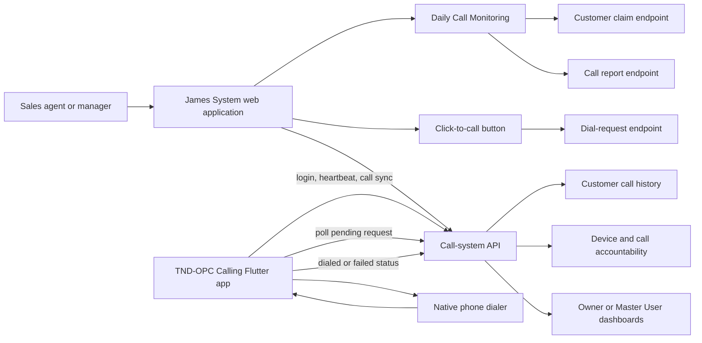

# TND-OPC Calling Solution

## Document control

| Item | Description |
|---|---|
| **Document title** | TND-OPC Calling Solution: User, Technical, and Operational Guide |
| **System** | TND-OPC James System |
| **Document status** | Current implementation reference |
| **Prepared for** | Business owners, Master Users, managers, sales agents, support staff, and developers |
| **Prepared by** | Manus AI |
| **Current implementation snapshot** | 24 August 2026 |
| **Database position** | This document describes the existing application and calling integration. It does not authorize database-schema changes. |

## 1. Executive summary

The TND-OPC Calling Solution connects the web-based James System with a staff phone application. It supports two related but distinct calling workflows.

The first workflow is **Daily Call Monitoring for sales agents**. An agent opens the Daily Call Monitoring page, selects a customer, and presses **Call**. The system first places a temporary claim on that customer so another agent cannot work on the same customer at the same time. It then opens the customer contact window, where the agent can review customer information, communicate, and submit a conversation report. When the report is submitted, the activity is stored and becomes visible in the owner or Master User customer timeline. If the agent closes the contact window without submitting a report, the customer claim is released.

The second workflow is **website click-to-call queueing**. A user presses a reusable **Call customer** button from supported customer, sales inquiry, sales order, or detail screens. The website asks for confirmation, sends a dial request to the authenticated staff member’s registered phone, and informs the user that the phone will ask for a second confirmation. The phone application receives the request, asks the staff member to confirm, opens the phone’s native dialer, and reports whether the request was dialed or failed. This workflow is implemented by `CallCustomerButton`, `queueCallRequest`, the call-system API, and the Flutter companion app. [1] [2] [3]

The solution is designed for **accountability without audio recording**. It records call metadata such as phone number, direction, timestamp, duration, staff account, device, and customer match where available. The system does not record the call’s audio. [4] [5]

## 2. Purpose and business outcomes

The calling solution is intended to make customer follow-up more consistent, prevent duplicated work, connect call activity to the correct customer, and give management a reliable view of staff-phone availability and hardware call metadata.

| Business need | How the solution addresses it |
|---|---|
| Agents need a focused daily call list | Daily Call Monitoring groups customers into actionable categories and exposes search, filters, customer details, call, message, and verification actions. |
| Agents need to call from the customer context | The customer row provides a Call action, and supported screens provide the reusable click-to-call control. |
| Two agents must not call the same customer simultaneously | Daily Call Monitoring uses a server-side customer claim before opening the call window. |
| Management needs evidence of phone activity | The phone application uploads hardware call metadata, while accountability panels display device status and call records. |
| Management needs to distinguish reported activity from phone activity | Agent-entered reports are stored as application activity; phone-synchronized records are stored as hardware call metadata and labeled by source. |
| Phone monitoring must continue when the app is not in the foreground | The companion application uses a visible foreground service, periodic heartbeat, and polling for queued dial requests. |
| Privacy must be protected | The current solution records metadata only and explicitly states that it does not record call audio. |

## 3. High-level architecture

The solution has four cooperating parts: the web application, the local/API service layer, the call-system API, and the staff phone application.



### 3.1 Web application

The web application contains the customer lists, Daily Call Monitoring screens, customer detail views, reusable click-to-call controls, call-history displays, accountability panels, and auto-reply settings. The main agent-facing calling screen is `DailyCallMonitoringView`. The owner or management-facing workspace is selected through the Daily Call Monitoring route and uses the owner dashboard components. [6] [7]

### 3.2 Service layer

The web service layer adds the authenticated session token to call-system requests, creates and releases customer claims, queues dial requests, creates application call reports, loads hardware call logs, loads device health, and handles auto-reply settings. The service returns normalized data to React components so the UI does not need to understand every API response variation. [2]

### 3.3 Call-system API

The API validates the authenticated staff account, company scope, registered device, phone number, call direction, duration, timestamps, request status, date filters, and role access. It also matches uploaded phone numbers to customers within the authenticated company scope. The API prevents a device from being silently reassigned between staff accounts. [3]

### 3.4 Staff phone application

The Flutter application is named **TND-OPC Calling**. It logs in using the same staff credentials used by the website, registers the device, requests required permissions, starts visible background monitoring, polls pending dial requests, asks for confirmation before opening the native dialer, and synchronizes call-log metadata. [5]

## 4. User roles and access model

The route `sales-transaction-daily-call-monitoring` selects the experience based on the authenticated user role. Sales agents receive the agent-oriented Daily Call Monitoring workflow. Non-sales-agent users receive the owner or management-oriented unified workspace. [6]

| User type | Main responsibilities | Relevant access |
|---|---|---|
| **Sales Agent** | Work assigned customer calls, open customer information, submit conversation reports, send SMS activity, request prospect verification, and release unfinished call claims. | Agent Daily Call Monitoring view and own phone activity. |
| **Manager or Owner** | Review customer categories, current and potential sales, human-agent activity, customer timelines, device status, and hardware call metadata. | Owner or management Daily Call Monitoring workspace, customer details, accountability panels, and team-scoped records where permitted. |
| **Master User** | Manage company-wide calling visibility and missed-call auto-reply configuration. | Team-scoped devices and call logs, global auto-reply settings, and audit records. |
| **Registered staff phone** | Poll for dial requests, open the native dialer after confirmation, report dial status, send heartbeat, and upload call metadata. | Only requests and data authorized for the registered staff account and device. |

The server determines team visibility from authentication claims. Master Users can view team-level devices and call logs; ordinary staff are restricted to their own scope. Auto-reply settings are restricted to Master Users. [3]

## 5. Daily Call Monitoring workflow for sales agents

### 5.1 Open the page

The agent opens **Sales → Daily Call Monitoring**. The page loads the agent’s permitted customer snapshot, including contacts, call logs, inquiries, purchases, team messages, customer status, assignment, purchase history, and activity information. The service requests data using the authenticated staff context and company scope. [2] [6]

The page organizes customers into operational categories. The exact category rules are defined by the current application logic and may include priority, recovery, verified prospects, unverified prospects, and other customer groupings. The agent can search, filter, review category summaries, and open a customer detail panel.

### 5.2 Select a customer

The agent can select a customer by clicking the customer row or customer name. The detail panel provides customer contact information, location, assigned agent, account status, sales information, customer activity, and available communication actions.

The detail experience includes overview, management instructions, human-agent activity, AI-agent activity, communication timeline, sales, item issues, orders, collections, incident reports, and sales returns. Human-agent call reports are identified separately from general activity by the `[Sales Agent Report]` marker. [8]

### 5.3 Press Call

The customer row includes a **Call** action. The current Daily Call Monitoring agent action performs the following steps:

1. It requests a server-side customer claim using the customer ID.
2. If the server rejects the claim because another agent is already working with the customer, the page shows an error and does not open the call window.
3. If the claim succeeds, the page opens the contact window, clears the previous report form, and loads the full customer record.
4. The page starts a five-minute claim heartbeat while the contact window remains open.
5. The agent can review the customer and enter a conversation report.

The claim protects the customer workflow from simultaneous agent handling. It is separate from the phone dialer queue described in Section 6. [9]

### 5.4 Submit a conversation report

The agent enters the conversation result and selects an outcome. The current report operation sends an outbound call activity with the following information:

| Field | Current behavior |
|---|---|
| Customer | The claimed customer ID |
| Agent | The current agent name, or the authenticated display name fallback |
| Channel | `call` |
| Direction | `outbound` |
| Duration | Currently recorded as `0` by the manual report workflow |
| Notes | The report text prefixed with `[Sales Agent Report]` |
| Outcome | The selected report outcome |
| Timestamp | Current ISO timestamp |
| Next action | Currently sent as empty/null by this workflow |

After a successful submission, the system shows a success message, closes the contact window, clears the report form, and makes the report available to the Master User in the customer activity timeline. [9]

### 5.5 Close without submitting

If the agent closes the call contact window without submitting a report, the browser releases the customer claim through the release endpoint. This allows another authorized agent to work with the customer. If release fails, the application records the failure for troubleshooting; the user is not blocked from closing the window. [9]

### 5.6 Claim renewal and expiration considerations

While the call contact window is open, the web page renews the claim every five minutes. This prevents an active work session from becoming stale during a longer customer interaction. If the browser is closed, the device loses connectivity, or the page is abandoned, the application should be reopened and the customer claim should be checked before continuing.

## 6. Click-to-call workflow

### 6.1 Important distinction

There are two call-related actions in the current system:

| Action | What it does | Where it is used |
|---|---|---|
| **Daily Call Monitoring → Call** | Claims the customer and opens the agent’s call/report workspace. The manual call report is submitted after the conversation. | Agent Daily Call Monitoring customer list. |
| **Call customer / click-to-call button** | Sends a dial request to the staff member’s registered phone. The phone asks for confirmation and opens the native dialer. | Supported customer, sales inquiry, sales order, and customer-detail screens. |

The reusable click-to-call control is `CallCustomerButton`. It is not the same as the Daily Call Monitoring claim-and-report action. This distinction should be retained in user training and support materials. [1] [9]

### 6.2 Website click-to-call procedure

The website click-to-call procedure is:

1. Open a supported customer, sales inquiry, sales order, or customer-detail screen.
2. Confirm that a phone number is displayed.
3. Press **Call customer** or the equivalent call button.
4. The website displays a first confirmation asking whether to queue a call request for the number.
5. Confirm the request. If the user cancels, nothing is sent.
6. The website sends an authenticated `POST` request to the dial-request endpoint.
7. The website displays a success message stating that the request was sent to the staff phone and that the phone will ask for a second confirmation.
8. If the request cannot be queued, the website displays an error and does not claim that the call was started.
9. The button is disabled while the request is being queued and is disabled when no phone number is available.

The web component stops the click event from propagating to the surrounding customer row, preventing an accidental row-selection action. [1]

### 6.3 Phone-side click-to-call procedure

After the website queues the request, the staff phone application receives it through its polling cycle:

1. The phone app polls the pending dial-request endpoint every ten seconds while the user is signed in and monitoring is active.
2. When a new request is found, the phone shows a visible notification and opens a confirmation dialog when the request is handled.
3. The staff member reviews the number and chooses **Open dialer** or **Cancel**.
4. If the staff member cancels, the app marks the request as `failed`.
5. If the staff member confirms, the app opens the native phone dialer with a `tel:` URI.
6. The app marks the request as `dialed` if the native dialer launch succeeds, or `failed` if it does not.
7. The server accepts only the final states `dialed` and `failed` for this update operation.

This two-step confirmation is intentional. The website confirmation prevents accidental queueing, and the phone confirmation prevents a queued request from opening the dialer without staff approval. [3] [5]

### 6.4 Click-to-call limitations

The current click-to-call workflow queues a request and opens the phone’s native dialer. It does not silently place a call and does not bypass the phone’s confirmation step. The result `dialed` confirms that the native dialer was launched, not that the customer answered or that the conversation was successful.

The phone-side hardware call-log synchronization is the mechanism that later provides actual call metadata such as direction, duration, and timestamp. [4] [5]

## 7. Staff phone application procedure

### 7.1 Initial setup

The staff phone application requires a compatible Android device, the TND-OPC Calling application, the James System API server URL, a valid staff account, network access to the API, and the required Android permissions.

The Android manifest declares internet and network-state permissions, call-log and phone-state permissions, notification permission, foreground-service permissions, and dialer intent visibility. [10]

### 7.2 Sign in

The staff member enters:

- The TND-OPC API server URL.
- The same staff email used by the James System website.
- The staff password.

The app calls `/api/v1/auth/login`. After a successful login, it stores the session token, server URL, generated or previously stored device ID, and staff display name in local preferences. The app then refreshes permissions, registers the phone, starts the calling background service, and begins dial-request polling. [5] [2]

### 7.3 Device registration

The phone registers itself against the authenticated staff account using a device ID and an initial `app_open` status. The API rejects an attempt to register a device that is already assigned to another staff account. This prevents one phone from silently moving between accounts. [3] [5]

### 7.4 Permissions

The application checks notification permission and phone/call-log permission. The user can select **Review permissions** to request them again. Without phone permission, call-history synchronization cannot proceed and the server can report `permission_missing` as the device health status. [5]

### 7.5 Visible background monitoring

The app uses a foreground service with a visible notification. The notification communicates that TND-OPC Calling monitoring is active. This is an explicit user-visible design rather than a hidden background process.

The app sends a heartbeat every two minutes. The heartbeat reports `background_active` when phone permission is available, or `permission_missing` when it is not. If the API cannot be reached, the app reports `no_network` locally. [4] [5]

### 7.6 Dial-request polling

The app polls for pending dial requests every ten seconds. It remembers request IDs already handled during the current app process so the same request is not repeatedly presented. When requests are pending, the app shows a high-priority notification telling the staff member to open TND-OPC Calling and review the request. [5]

### 7.7 Call-history synchronization

When phone permission is available, the background service reads the device call history using the call-log integration. It starts from the last successful sync time minus a five-minute overlap window. The overlap reduces the risk of missing a call that was written near the previous sync boundary.

Each entry is uploaded only when it has a recognized direction, phone number, and timestamp. The current mapping is:

| Phone call type | Uploaded direction |
|---|---|
| Incoming or Wi-Fi incoming | `inbound` |
| Outgoing or Wi-Fi outgoing | `outbound` |
| Missed or rejected | `missed` |
| Unsupported or incomplete entry | Skipped |

The upload includes device ID, phone number, direction, duration in seconds, and UTC call timestamp. After the sync completes, the app records the current time as the last sync position. [4] [5]

## 8. API contract overview

The call-system controller exposes the following logical operations. Exact URL prefixes are shown as implemented in the clients.

| Operation | Method and endpoint | Purpose |
|---|---|---|
| Staff login | `POST /api/v1/auth/login` | Authenticate the companion phone app using staff credentials. |
| Register device | `POST /api/v1/call-system/devices/register` | Bind a device to the authenticated staff account. |
| Heartbeat | `POST /api/v1/call-system/devices/heartbeat` | Report that the visible background service is running and provide device status. |
| Upload hardware call log | `POST /api/v1/call-system/call-logs` | Store phone call metadata and match the phone number to a customer when possible. |
| Queue dial request | `POST /api/v1/call-system/dial-requests` | Create a request for the authenticated staff phone to review. |
| Poll pending requests | `POST /api/v1/call-system/dial-requests/poll` | Return pending requests for the registered device. |
| Update dial request | `PATCH /api/v1/call-system/dial-requests/{requestId}/status` | Mark a request `dialed` or `failed`. |
| List devices | `GET /api/v1/call-system/devices` | Return device health within the permitted staff or team scope. |
| List hardware calls | `GET /api/v1/call-system/call-logs` | Return hardware call metadata with optional direction, agent, customer, and date filters. |
| Get auto-reply settings | `GET /api/v1/call-system/auto-reply-settings` | Read the Master User’s missed-call auto-reply configuration. |
| Save auto-reply settings | `POST /api/v1/call-system/auto-reply-settings` | Save a validated template and cooldown configuration. |
| List auto-reply audit | `GET /api/v1/call-system/auto-reply-audit` | Review automated missed-call reply activity. |

### 8.1 Authentication

Web requests use the local authenticated session token as a Bearer token. Phone requests use the token saved after mobile login. The server derives the authenticated staff ID from claims and derives company scope from the authenticated `main_userid` claim. Missing or invalid claims are rejected. [2] [3]

### 8.2 Request validation

The API validates phone number presence and length, call direction, duration range, call timestamp, device ID, device status, dial-request ID, final dial status, date-filter format, and role access. Hardware logs are accepted only from a device registered to the same staff account that is making the request. [3]

### 8.3 Customer matching

When the phone application uploads a call log or the website queues a dial request, the API attempts to match the phone number to a customer in the authenticated company scope. The response includes whether a customer was matched. A failed customer match does not by itself mean that the phone call failed; it means the number was not linked to a customer record at that time. [3]

## 9. Data and record lifecycle

### 9.1 Manual agent report

```text
Customer row selected
        ↓
Server claim acquired
        ↓
Contact window opened
        ↓
Agent writes conversation report
        ↓
Application call log created
        ↓
Report appears in customer activity timeline
        ↓
Contact window closes and claim is released
```

### 9.2 Hardware call record

```text
Phone call occurs
        ↓
Android call log receives metadata
        ↓
Background service reads eligible entries
        ↓
Entry is normalized to inbound/outbound/missed
        ↓
API validates device and fields
        ↓
Server matches customer by phone when possible
        ↓
Hardware metadata appears in accountability/history views
```

### 9.3 Dial-request record

```text
User confirms website request
        ↓
API creates pending request
        ↓
Phone polls request
        ↓
Staff confirms or cancels on phone
        ↓
Native dialer opens or request fails
        ↓
Phone reports dialed/failed
```

## 10. Management, accountability, and reporting

### 10.1 Device health

The accountability panel displays the number of registered phones and the number currently reporting. It also shows the staff member, last signal time, and a status badge. Current status labels include:

| Status | Meaning |
|---|---|
| `background_active` | Background monitoring and heartbeat are active. |
| `app_open` | The calling app is open and communicating. |
| `permission_missing` | Required phone permission is not available. |
| `no_network` | The app cannot currently reach the API. |
| `device_offline` | The server considers the device offline. |
| Unknown or blank | The status is unavailable or not recognized by the UI. |

The accountability panel refreshes on demand and automatically every 60 seconds. [4]

### 10.2 Hardware call history

Hardware call history is shown at the customer level and in accountability views. The current display includes date, direction, phone number, duration, and staff name. Supported direction labels include Incoming, Outgoing, and Missed incoming. [4] [11]

### 10.3 Customer activity timeline

The owner customer-detail workspace displays customer activity across communication, orders, and other records. A manual sales-agent call report is labeled **Sales agent call report** when the activity is a call whose notes begin with `[Sales Agent Report]`. The report text is displayed without the internal marker. [8]

### 10.4 Missed-call auto-reply

The call-system API supports an optional missed-call auto-reply configuration. The Master User can select whether the setting is active, choose a message template, and set a cooldown from one minute through one week. The API records auto-reply audit entries and avoids treating non-missed calls as applicable to this automation. [3]

## 11. Privacy and security safeguards

The solution uses several safeguards:

1. **Authenticated requests:** Web and phone clients send Bearer tokens for protected call-system operations.
2. **Company scoping:** The API uses the authenticated company or Master User scope when matching customers and listing records.
3. **Device ownership:** A device cannot be registered to a different staff account without server rejection.
4. **Registered-device checks:** Hardware call uploads, pending-request polling, and dial-status updates require a device registered to the authenticated staff account.
5. **Role restrictions:** Team-level device and call-log views are restricted by authenticated role claims; missed-call auto-reply configuration is Master User-only.
6. **Two-step dialing confirmation:** The website confirmation queues the request, and the phone confirmation opens the native dialer.
7. **No audio recording:** The current accountability and synchronization design stores call metadata and does not record call audio.
8. **Input validation:** Phone numbers, dates, durations, directions, statuses, and IDs are validated by the API.
9. **Claim protection:** Daily Call Monitoring prevents multiple agents from simultaneously owning the same customer call workspace.

## 12. Normal operating procedures

### 12.1 Sales agent daily procedure

At the beginning of the work period, the agent signs in to the James System and opens Daily Call Monitoring. The agent reviews the priority and recovery customer groups, checks management instructions, and selects a customer. Before calling, the agent should confirm the visible phone number and customer identity.

The agent presses **Call**, waits for the customer workspace to open, conducts the call using the approved business process, records a clear conversation report, selects the correct outcome, and submits the report. The report should contain the customer’s request, agreed next step, responsible person, and due date where applicable. The agent should close the contact window only after the report has been submitted or the interaction is intentionally abandoned.

### 12.2 Click-to-call procedure

For a supported screen, the user presses **Call customer**, confirms the website prompt, waits for the phone notification, opens the TND-OPC Calling app if necessary, reviews the number, and confirms **Open dialer**. After the call, the phone application synchronizes the hardware call metadata when permission and connectivity are available.

### 12.3 Manager daily procedure

The manager or owner reviews the owner Daily Call Monitoring workspace, checks current sales and potential sales summaries, reviews human-agent activity and communication timelines, and checks device accountability. Devices showing permission missing, no network, or offline status should be followed up with the staff member before interpreting missing hardware calls as missed work.

## 13. Troubleshooting guide

| Symptom | Likely cause | Recommended action |
|---|---|---|
| The website Call customer button is disabled | No phone number is present, or another queue request is still being processed. | Confirm the customer record contains a valid phone number and wait for the current request to finish. |
| Website says the call request could not be queued | Missing login, API error, invalid session, or unavailable service. | Confirm the web session, API availability, and browser network connection. Review the displayed error message. |
| Phone does not receive a request | Background service is stopped, phone is offline, device is not registered, or polling is not running. | Open TND-OPC Calling, confirm sign-in, confirm device registration, check network, and check the device status panel. |
| Phone reports permission missing | Android phone/call-log permission was denied or revoked. | Use **Review permissions**, grant required permissions, and wait for the next heartbeat. |
| Phone shows no network | API server is unreachable or the phone has no usable network path. | Confirm Wi-Fi/mobile data, API URL, VPN/firewall rules, and server availability. |
| Dialer does not open | Native dialer launch failed or the phone did not accept the `tel:` intent. | Confirm a default dialer is configured and retry the request. The request should be reported as failed rather than falsely treated as dialed. |
| Hardware call has no customer match | Phone number formatting differs or the customer number is not in the same company scope. | Review the customer phone number and call-log phone number. Correct the customer record if appropriate. |
| Daily Call Monitoring says another agent is using the customer | A live claim exists for the customer. | Wait for the other agent to finish, or ask the other agent to close the contact window. |
| A manual call report is missing from the timeline | The report was not submitted, the API request failed, or the customer timeline has not refreshed. | Confirm the agent received a success message, refresh the customer timeline, and check the API/application logs. |
| Device status is stale | The app was stopped, the foreground service was disabled, or the phone cannot reach the API. | Open the app, confirm the visible monitoring notification, check permissions and network, and review the last signal time. |

## 14. Operational boundaries and current implementation notes

The current solution should be understood with the following boundaries:

| Area | Current state |
|---|---|
| Manual Daily Call Monitoring reports | Implemented in the web application. These reports record the agent’s report and currently use duration `0` because the workflow is report-based rather than a live timer. |
| Web click-to-call queueing | Implemented through `CallCustomerButton` and the call-system dial-request API. |
| Phone confirmation before dialing | Implemented in the Flutter companion application. |
| Native dialer launch | Implemented using the phone `tel:` intent. |
| Hardware call-log synchronization | Implemented when phone permission, background monitoring, and network connectivity are available. |
| Customer matching by phone | Implemented server-side within company scope. |
| Device accountability | Implemented through device health and hardware call-log views. |
| Call audio recording | Not implemented; the current design explicitly states that audio is never recorded. |
| Answered-call confirmation | Not provided by the current dial-request status. `dialed` means the native dialer was launched, not that the customer answered. |
| Automatic dialing without staff confirmation | Not permitted by the current phone workflow. |
| Hardware Verified badge, total actual call-duration summary, and unmatched-call section | Listed in the project implementation notes as integration goals. Their availability should be verified separately before promising them as production features. |
| Mobile app deployment operations | The repository contains a Flutter companion app, but release signing, Play Store distribution, device fleet management, and production support ownership must be documented separately. |

## 15. Testing and verification reference

The repository contains focused tests for the calling service, click-to-call control, accountability panel, customer call history, and auto-reply settings. The calling-service tests cover customer list and snapshot loading, normalization, call-log creation, authenticated claim acquisition and release, legacy customer logs, retry behavior, and periodic refresh callbacks. The click-to-call tests cover queue success, queue failure, confirmation cancellation, and missing phone behavior. [12] [13]

Before a production release, the recommended verification sequence is:

1. Confirm the web user can sign in and access the correct role-specific Daily Call Monitoring experience.
2. Confirm an agent can select a customer, claim the customer, open the call window, submit a report, and see the report in the customer timeline.
3. Confirm closing without submission releases the claim.
4. Confirm the website click-to-call control asks for confirmation and queues only after confirmation.
5. Confirm the phone receives the pending request, asks for a second confirmation, and reports `dialed` or `failed` correctly.
6. Confirm a hardware call log uploads with valid direction, duration, timestamp, staff, device, and customer match behavior.
7. Confirm the owner accountability panel displays current device status and hardware call metadata.
8. Confirm revoked permission and offline conditions produce visible status changes rather than silent data loss.
9. Confirm role restrictions prevent staff from viewing team-level information or changing Master User-only settings.

## 16. Glossary

| Term | Meaning |
|---|---|
| **Application call report** | A report manually entered by a sales agent after a conversation in Daily Call Monitoring. |
| **Call claim** | A temporary server-side lock associated with a customer and agent while the contact window is open. |
| **Click-to-call** | The web-to-phone workflow that queues a phone request and opens the native dialer after phone confirmation. |
| **Dial request** | A server record waiting for a registered staff phone to review and process. |
| **Hardware call log** | Call metadata synchronized from the phone’s native call history. |
| **Heartbeat** | A periodic phone status update indicating that the background monitor is still active. |
| **Master User** | The company-level user role with team-scoped visibility and access to global missed-call auto-reply settings. |
| **Native dialer** | The phone’s standard dialer application opened through a `tel:` URI. |
| **Pending request** | A dial request that has not yet been marked `dialed` or `failed`. |
| **Registered device** | A phone bound by the server to one authenticated staff account. |

## References

[1]: ../components/CallCustomerButton.tsx "Reusable web click-to-call button"
[2]: ../services/callingSystemService.ts "Web call-system service"
[3]: ../../api/src/Controllers/CallSystemController.php "Call-system API controller"
[4]: ../components/CallAccountabilityPanel.tsx "Calling accountability panel"
[5]: ../../calling_app/lib/main.dart "Flutter calling app user interface and dial-request workflow"
[6]: ../App.tsx "Application route selection and role-specific Daily Call Monitoring view"
[7]: ../components/OwnerDailyCallMonitoringUnifiedView.tsx "Owner and management Daily Call Monitoring workspace"
[8]: ../components/DailyCallCustomerDetailExpansion.tsx "Customer detail tabs and activity labeling"
[9]: ../components/DailyCallMonitoringView.tsx "Sales-agent Daily Call Monitoring workflow"
[10]: ../../calling_app/android/app/src/main/AndroidManifest.xml "Android calling-app permissions and service declarations"
[11]: ../components/CustomerCallHistoryCard.tsx "Customer hardware call-history display"
[12]: ../services/__tests__/dailyCallMonitoringService.test.ts "Calling service contract tests"
[13]: ../components/__tests__/CallCustomerButton.test.tsx "Click-to-call component tests"
